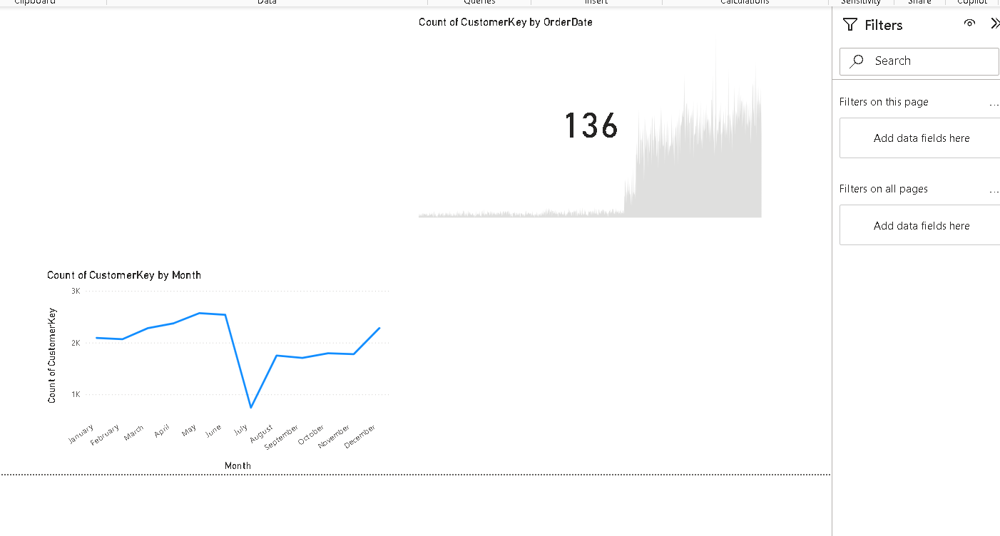

# Sales-Sync-Analytics
# Azure Data Engineer Project: End-to-End Data Pipeline

An end-to-end data pipeline showcasing Azure Data Engineer skills for data ingestion, transformation, storage, and visualization.

## Overview
- **Objective**: Process raw CSV data into actionable insights.
- **Tools**: Azure Data Factory, Databricks, Synapse Serverless SQL Pool, Power BI, ADLS Gen2.

## Architecture
1. **Ingestion**: ADF pipeline pulls CSV files from GitHub into ADLS G2 Bronze container.
2. **Transformation**: Databricks (PySpark) cleanses and transforms data, saving Parquet files to Silver container.
3. **Processing**: Synapse Serverless SQL Pool creates views and external tables in Gold container.
4. **Visualization**: Power BI dashboards display insights from Synapse data.

## Repo Contents
- `adf/`: ADF pipeline JSON files.
- `databricks/`: PySpark notebook for data transformation.
- `synapse/`: SQL scripts for views and external tables.
- `data/`: Sample CSV file.
- `screenshots/`: Pipeline and dashboard visuals.

## Setup
1. Deploy ADF pipelines from `adf/` in Azure Data Factory.
2. Import `databricks/data_transform.py` into Databricks.
3. Run `synapse/*.sql` in Synapse Studio.
4. Connect Power BI to Synapse Gold container views/tables.

## Screenshots

